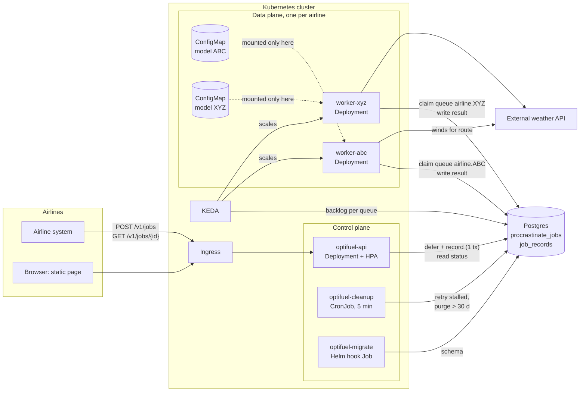
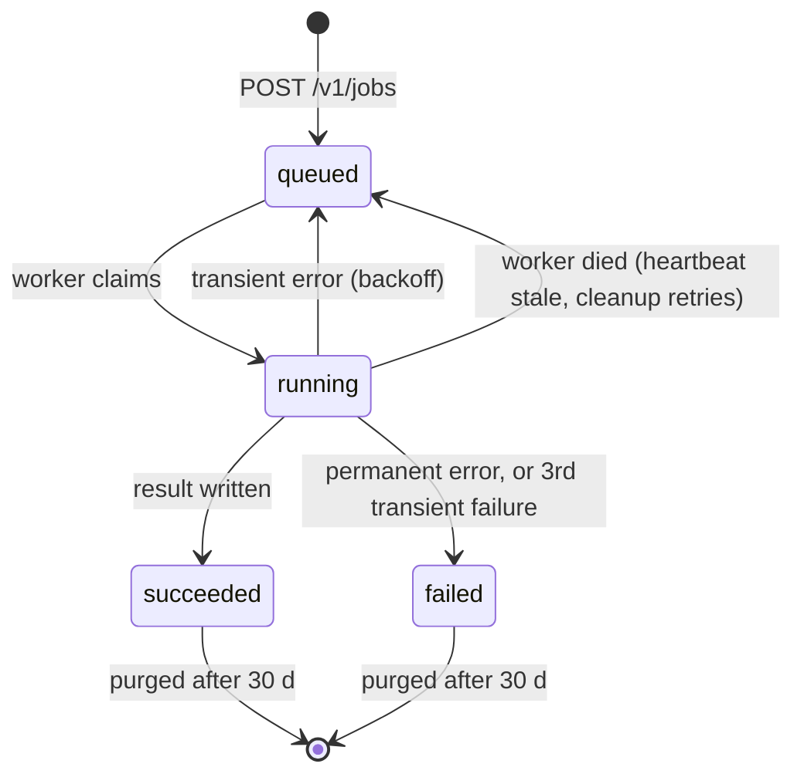
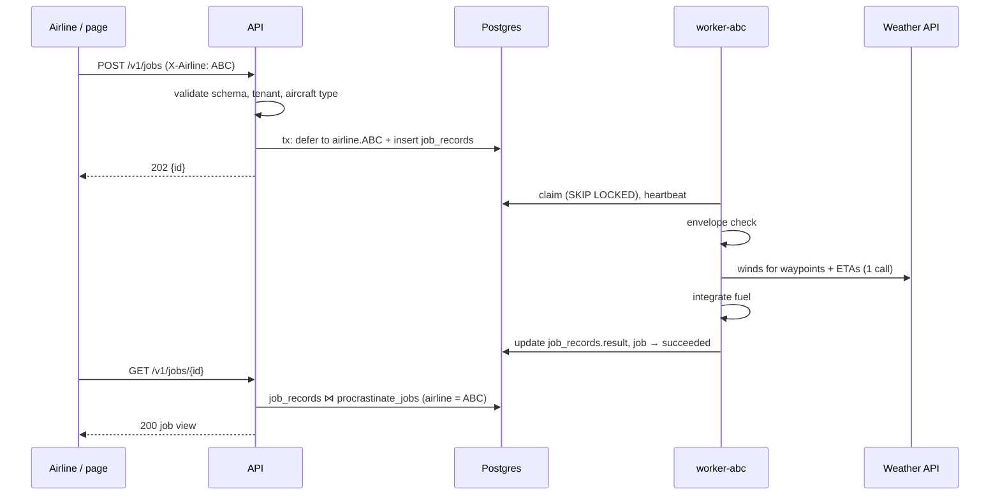

# OptiFuel architecture

OptiFuel receives airline flight plans as events, estimates route fuel with each airline's own
model, and stores the result. This document holds the decisions, the design, and the
implementation plan for exercise 2 (proof of concept, production-minded).

Guiding rule: least machinery that meets the brief. Every "not now" below names the trigger that
would bring it in.

## 1. Shape: control plane + data plane

- **Control plane**: the API and Postgres. Registers jobs, exposes one tracking contract, cleans up.
- **Data plane**: one worker Deployment per airline. Claims that airline's jobs, runs inference,
  writes results.



## 2. Decisions

| # | Decision | Rejected | Why |
|---|---|---|---|
| D1 | Control plane / data plane split. One generic job contract (`id, type, airline, status, attempts, timestamps, result, error`) and a job-type registry holding one type, `fuel_estimate`. | Generic multi-team job platform; OptiFuel-only code with no contract. | New job types and pipeline steps plug in without reshaping the API. A platform nobody asked for is YAGNI. |
| D2 | Long-running worker Deployments pulling from a queue. | Kubernetes `Job` per event; operator with an `InferenceJob` CRD; KEDA `ScaledJob`. | Inference takes milliseconds, pod start takes seconds. etcd is not a job store. Workers keep the model in memory. |
| D3 | Postgres only: queue, job records, results. | Kafka / Pub/Sub; Redis queue + Postgres. | Around 10⁵ flights/day worldwide, so tens of events/s at peak [inference], far below a Postgres queue's ceiling. Deferring the job and writing its record share one transaction, so no dual-write. One stateful dependency. |
| D4 | Procrastinate 3.10 as the queue library. | Hand-rolled `SKIP LOCKED`; PgQueuer; DBOS; oban-py; chancy; bullmq (Postgres backend). | Most mature Postgres queue for Python. Has per-queue workers, retries limited to listed exceptions, heartbeat stall detection, `remove_old_jobs`, and an in-memory connector. PgQueuer moves finished jobs to a log table. DBOS needs its paid Conductor to recover a dead pod's work. oban-py is beta. bullmq's Postgres backend is 2 months old. |
| D5 | HTTP ingress: `POST /v1/jobs` returns `202 {id}`. Clients poll. | Airlines publish to a broker; webhooks; SSE. | Simplest contract an airline can call. Polling needs no extra infrastructure. |
| D6 | Tenant isolation: per-airline queue, worker Deployment and model mount. Shared API and Postgres, filtered by airline. | Shared worker pool loading any model; namespace or database per airline. | A worker can only read its own airline's model, and a busy airline can't starve the others. Namespace-per-airline is the premium tier: the same chart installed once per namespace. |
| D7 | Models are JSON parameters with a validity envelope, keyed by airline, version pinned in config, read through a `ModelRepository` interface. | joblib/pickle; ONNX. | Loading runs no code. The Q4 model is 3 numbers. The loader dispatches on `form`, so a new model family means a new loader. |
| D8 | Fuel = Σ fuel flow × segment time, with ground speed corrected by wind. A waypoint outside the model envelope fails the job. | Ignoring wind; extrapolating; clamping. | Exercise 1: wind doesn't change fuel flow (speed is airspeed) but does change time over ground. Underestimating fuel is a safety risk, so fail loud. |
| D9 | Mocked auth: the `X-Airline` header is trusted by one FastAPI dependency. | Full API-key/OIDC flow in the MVP. | MVP scope. Isolation rules (401/403/404) are still enforced and tested. Production swaps only that dependency for OIDC at the gateway. |
| D10 | One static HTML page served by FastAPI. | SPA with a build chain; PgQueuer-style ops dashboard. | Launch + track is one form and one table. No build tooling, same image. |
| D11 | Helm chart for Kubernetes; docker compose for local dev; kind smoke script. | Kustomize; compose only. | Helm's `range` over `tenants` renders per-airline resources from one list. |
| D12 | Logs with `job_id` and `airline`, `/health`, `/ready`. | Metrics/tracing in the MVP. | Enough to operate a PoC. Metrics are the first addition (§10). |

**When Kafka earns its place**: several independent consumers of flight-plan events, a replay or
audit-stream requirement, or joining an existing event backbone. The ingress adapter then
consumes a topic and defers jobs exactly like the HTTP handler. Workers don't change.

## 3. Job contract

### API

| Method | Path | Result |
|---|---|---|
| `POST` | `/v1/jobs` | `202 {"id": ...}`, or the existing job's id for a duplicate plan |
| `GET` | `/v1/jobs/{id}` | Job view below; `404` if missing or owned by another airline |
| `GET` | `/v1/jobs?limit=50` | Caller's airline's jobs, newest first |
| `GET` | `/v1/tenants` | Configured airline codes, for the page's selector. `ponytail:` exists only because auth is mocked; removed with real auth. |
| `GET` | `/health` | Liveness: process up |
| `GET` | `/ready` | Readiness: `SELECT 1` against Postgres |
| `GET` | `/` | Static page |

Body of `POST /v1/jobs`: `{"type": "fuel_estimate", "payload": <FlightPlan>}`.

Job view:

```json
{
  "id": 42, "type": "fuel_estimate", "airline": "ABC", "flight_id": 123,
  "status": "succeeded", "attempts": 1,
  "submitted_at": "2026-09-30T10:00:00Z", "finished_at": "2026-09-30T10:00:01Z",
  "result": {"total_fuel_lb": 1234.5, "distance_km": 812.3, "duration_h": 3.9,
             "model_version": "2026-09-30"},
  "error": null
}
```

### Rejected at the API, never queued

| Condition | Status |
|---|---|
| Payload fails `FlightPlan` / job-type schema | 422 |
| `X-Airline` missing or not configured | 401 |
| `payload.airline` differs from `X-Airline` | 403 |
| `aircraft_type` not enabled for the airline | 422 |
| Unknown job `type` | 422 |

### Lifecycle



Procrastinate status maps to the contract: `todo → queued`, `doing → running`, `succeeded`,
`failed`. `cancelled` and `aborted` are unreachable: there is no cancel endpoint.

- **Transient**: weather timeout, connection error or 5xx; Postgres `OperationalError`. Retried
  via `RetryStrategy(max_attempts=3, exponential_wait=5, retry_exceptions={...})`.
- **Permanent**: `out_of_envelope`, model file missing, ground speed ≤ 0. Fail at once.
- **Dead letters**: `failed` jobs with their `error`. Resubmitting the same plan creates a new job.
- **Duplicates**: `plan_key = sha256(canonical payload)`. The API returns the airline's latest
  not-failed job with that key. `queueing_lock = "{airline}:{plan_key}"` catches two identical
  requests racing; `AlreadyEnqueued` resolves to the existing job.

### Submit → result



## 4. Data model

Procrastinate owns `procrastinate_jobs` (queue, status, attempts, args, heartbeat worker). We own
one table:

```sql
CREATE TABLE IF NOT EXISTS job_records (
    job_id       bigint PRIMARY KEY REFERENCES procrastinate_jobs (id) ON DELETE CASCADE,
    airline      text        NOT NULL,
    type         text        NOT NULL,
    flight_id    bigint      NOT NULL,
    plan_key     text        NOT NULL,
    submitted_at timestamptz NOT NULL,
    finished_at  timestamptz,
    result       jsonb,
    error        text
);
CREATE INDEX IF NOT EXISTS job_records_airline_submitted
    ON job_records (airline, submitted_at DESC);
CREATE INDEX IF NOT EXISTS job_records_plan ON job_records (airline, plan_key);
```

- Status has one source: `procrastinate_jobs.status`. Payload, outcome and timestamps come from
  `job_records`.
- Job args: `{"flight_plan": {...}}`; the Procrastinate task name is the job type
  (`fuel_estimate`). Queue: `airline.<CODE>`.
- The worker writes `error` on every failed attempt, so a job that fails for good keeps its last
  error. Success writes `result` and clears `error`.
- `remove_old_jobs` deletes old jobs; `ON DELETE CASCADE` removes their records.
- The API writes `job_records` in the same transaction as the defer:
  `App.configure_task(..., connection=conn).defer(...)` (Procrastinate 3.10) runs the job insert
  on the API's own connection, inside its transaction.

## 5. Tenant isolation

| Asset | Isolation | Mechanism |
|---|---|---|
| Compute | Physical per airline | Own worker Deployment and KEDA scaler |
| Queue | Logical | `queue_name = airline.<CODE>`; a worker listens to its own queue only |
| Model | Physical | Airline's ConfigMap mounted only into its worker; no other worker can read it |
| Job data | Logical | Every query filters by the caller's airline; other airlines' jobs return 404 |
| Identity | Mocked | `X-Airline` header (D9) |

The worker refuses to start if `OPTIFUEL_WORKER_AIRLINE` has no model mounted: no default model,
no shared fallback.

`ponytail:` job data is isolated in application code only. Upgrade path: Postgres row-level
security keyed on a per-transaction `app.airline` setting, then database-per-airline for the
premium tier.

## 6. Fuel estimation

Model (exercise 1, Q4), fitted in log space on all flights:

$$ff = e^{12.75644}\, v^{0.99981}\, h^{-1.99903} \approx 346\,600 \cdot \frac{v}{h^{2}}$$

`ff` in lb/h, `v` = true airspeed in km/h, `h` in ft. Validated only for 24–238 km/h and
1000–10 000 ft.

Model file (`models/ABC/2026-09-30.json`):

```json
{
  "airline": "ABC", "version": "2026-09-30", "form": "power_law",
  "coefficients": {"ln_c": 12.75644, "speed": 0.99981, "altitude": -1.99903},
  "envelope": {"speed_kmh": [24, 238], "altitude_ft": [1000, 10000]}
}
```

Route computation, for segment *i* from waypoint *i* to *i+1*:

1. Reject the job (`out_of_envelope`, listing indices) if any waypoint is outside the model's
   envelope.
2. `dᵢ`: great-circle distance (haversine, R = 6371 km); `θᵢ`: initial bearing.
3. ETAs from still-air time (`dᵢ / vᵢ`) starting at `departure_time` (default: received time).
   One batched weather call for all waypoints and ETAs returns wind speed `wᵢ` (kt) and
   from-direction `φᵢ`. `ponytail:` ETAs ignore wind, so the lookup times are approximate;
   iterate once with ground-speed ETAs if forecast error matters.
4. Ground speed `gsᵢ = vᵢ − 1.852 · wᵢ · cos(φᵢ − θᵢ)`. `gsᵢ ≤ 0` fails the job.
5. `fuelᵢ = ff(vᵢ, hᵢ) · dᵢ / gsᵢ`. Result: `Σ fuelᵢ`, `Σ dᵢ`, `Σ dᵢ/gsᵢ`, model version.

`FlightPlan` validation: `airline` code, `aircraft_type`, `registration`, `flight_id`, at least
2 waypoints, latitude ∈ [-90, 90], longitude ∈ [-180, 180], `speed` > 0 (km/h airspeed, stated in
the schema), `altitude` > 0 (ft), optional `departure_time` (timezone-aware).

The assignment's sample plan cruises at 35 000 ft, so it fails with `out_of_envelope`. The page
and smoke test use an in-envelope plan.

## 7. Components and seams

Layers: controllers (HTTP) → services (business rules) → repositories (persistence) and clients
(external I/O). Every repository and client is a `Protocol` passed in at construction, so tests
hand in fakes:

| Seam | Real implementation | Used by |
|---|---|---|
| `JobRepository`: `ping`, `submit`, `latest`, `get`, `recent` (reads scoped to one airline) | Procrastinate defer + SQL on `job_records ⋈ procrastinate_jobs` | Job service (API) |
| `ResultRepository`: `record_success`, `record_error` | SQL on `job_records` | Fuel service (worker) |
| `FileModelRepository`: `load(airline, version)`, concrete; the Protocol lands with a second source (§10) | JSON file under `OPTIFUEL_MODEL_DIR` | Worker startup: loads its airline's model once and hands it to the fuel service |
| `WeatherClient`: `winds(points)` | HTTP client, bearer token, 5 s timeout: `POST /winds` `{"points": [{latitude, longitude, altitude_ft, eta}]}` → `{"winds": [{speed_kt, from_deg}]}` | Fuel service (worker) |
| `Clock`: `now()` | `datetime.now(UTC)` | Job and fuel services |

Job pipeline: `validate → check envelope → fetch winds → integrate → persist`. Each step is a
plain function. A new filter is one more function in the list. A new job type is one registry
entry (`type → payload model + Procrastinate task`). A new model family is one loader keyed by
`form`.

### Configuration

One `pydantic-settings` class read at startup, the only place environment variables are read:

| Variable | Type | Used by |
|---|---|---|
| `OPTIFUEL_ENVIRONMENT` | `dev` / `prod` | all |
| `OPTIFUEL_DATABASE_URL` | `SecretStr` | all |
| `OPTIFUEL_TENANTS` | JSON: `{"ABC": {"aircraft_types": ["B777"], "model_version": "2026-09-30"}}` | API, worker |
| `OPTIFUEL_WORKER_AIRLINE` | airline code | worker |
| `OPTIFUEL_MODEL_DIR` | path, default `/models` | worker |
| `OPTIFUEL_WEATHER_URL` | URL | worker |
| `OPTIFUEL_WEATHER_TOKEN` | `SecretStr` | worker |
| `OPTIFUEL_RETENTION_DAYS` | int, default 30 | cleanup |

Secrets come from a Kubernetes Secret (Helm) or `.env` (compose). Nothing secret goes in
ConfigMaps.

### Processes (one image)

| Process | Command | Kubernetes object |
|---|---|---|
| API | `uvicorn --factory optifuel.api:from_env` (image default) | Deployment + Service + HPA (CPU) |
| Worker | `python -m optifuel.worker` | Deployment per airline + KEDA ScaledObject |
| Migrate | `python -m optifuel.migrate` | Job, Helm `pre-install,pre-upgrade` hook |
| Cleanup | `python -m optifuel.cleanup` | CronJob `*/5 * * * *` |

- **Migrate** applies the Procrastinate schema if it's absent, then `job_records` DDL
  (`IF NOT EXISTS`). `ponytail:` no migration tool; Procrastinate upgrades need its versioned
  migration scripts, which is the point to adopt one.
- **Cleanup** retries jobs from workers whose heartbeat went stale (`get_stalled_jobs` →
  `retry_job`), then `remove_old_jobs` older than `RETENTION_DAYS`, including failed ones.

## 8. Scaling and resilience

KEDA, per airline, rendered from `tenants`:

```yaml
apiVersion: keda.sh/v1alpha1
kind: ScaledObject
metadata: {name: optifuel-worker-abc}
spec:
  scaleTargetRef: {name: optifuel-worker-abc}
  minReplicaCount: 1        # per-tenant value; 0 allowed at the cost of a cold start
  maxReplicaCount: 10
  triggers:
    - type: postgresql
      metadata:
        query: >-
          SELECT count(*) FROM procrastinate_jobs
          WHERE queue_name = 'airline.ABC' AND status IN ('todo', 'doing')
        targetQueryValue: "10"
      authenticationRef: {name: optifuel-postgres}
```

With `keda.enabled=false`, workers run `minReplicaCount` replicas. The API scales on CPU (HPA); it
is stateless.

| Failure | Behaviour |
|---|---|
| Worker crashes mid-job | Heartbeat goes stale after 30 s; cleanup requeues; `attempts` still caps retries |
| Weather API down or slow | 5 s timeout, retried with backoff, `failed` after 3 attempts with the error kept |
| Postgres down | `/ready` fails so the API is taken out of the Service; workers reconnect; queued work survives |
| Bad or missing model | Worker fails fast at startup (CrashLoopBackOff, visible); jobs wait queued |
| Traffic burst | Jobs queue in Postgres; KEDA adds workers for that airline only |
| Duplicate submissions | Same job returned (§3) |

Production Postgres is managed (RDS / Cloud SQL) with backups and a standby; add PgBouncer when the
worker count pushes connection limits.

## 9. Frontend

`src/optifuel/static/`, served at `/`: `index.html` (markup), `style.css`, `app.js`. No framework,
no build:

- Airline selector (from `GET /v1/tenants`), sent as `X-Airline`; the page's accent colour follows
  the airline.
- JSON textarea pre-filled with an in-envelope sample plan, and a Submit button. A route chart,
  altitude profile and plan summary redraw from the textarea as it is edited (display only; the
  server still validates).
- Jobs table (`GET /v1/jobs`), refreshed every 2 s: id, flight, status, attempts, fuel or error,
  with status counts and total fuel. A job opens a dialog with its full job view.
- Controls have labels and the table has headers; status is text, not colour only. Animations
  stop under `prefers-reduced-motion`.

## 10. Not now, and the trigger

| Item | Trigger |
|---|---|
| Real auth (OIDC at the gateway, airline claim) | Any exposure beyond the demo; swap the `current_airline` dependency |
| Row-level security / database per airline | Contractual or audit requirement on data isolation |
| Object storage + workload identity for models | Models beyond ConfigMap size (1 MiB) or managed by a training pipeline; new `ModelRepository` implementation |
| Webhooks / SSE | Airlines asking for push; Postgres `LISTEN/NOTIFY` feeds it |
| Kafka | See D3 triggers |
| Prometheus metrics (queue depth, job latency per airline) and OpenTelemetry traces | First production environment |
| Weather cache | Weather API rate limits or cost |
| Job cancel endpoint | Long-running job types |

## 11. Repository layout

Folder structure and layer rules: `AGENTS.md`, "Where it goes".

## 12. Implementation plan

Each step ends green on `uv run pre-commit run --all-files` and `uv run pytest`. Tests run
offline with fakes (tests red first).

1. **Dependencies.** `uv add procrastinate` (`pydantic-settings` landed with the skeleton), plus
   the weather HTTP client as a runtime dep (`httpx2`, already in the lock for tests). Confirm the
   Procrastinate atomic-defer API (§4).
2. **Schemas and fuel service.** `FlightPlan`, model schema, envelope check, fuel integration.
   Unit test only the integration math (headwind raises fuel versus calm air).
3. **Config and seams.** Extend `Settings` and the `conftest.py` app fixture (both from the
   skeleton); repository and client Protocols, fakes in `conftest.py`.
4. **Controllers and job service.** Job routes, `current_airline`, rejections, `/ready`,
   `/v1/tenants`, wired in `api.py`.
   *Check (end-to-end):* one parametrized `test_rejects_invalid_submission` (401 / 403 / 422
   cases) and `test_hides_other_airlines_jobs` (404).
5. **Queue and worker.** Procrastinate app, `fuel_estimate` task with retry strategy, Postgres
   repositories, `worker.py`, `migrate.py`, `cleanup.py`, `sql/schema.sql`.
   *Check (end-to-end, POST then GET):* `test_estimates_route_fuel` (succeeded, fuel in body,
   weather asked for every waypoint) and `test_fails_out_of_envelope_plan`.
6. **Static page.** `index.html` served at `/`.
7. **Compose.** `deploy/compose.yaml`: postgres (official image, tag+digest), migrate (one-shot),
   api, worker-abc, worker-xyz (each mounts only its model), WireMock weather stub.
   *Check:* `docker compose -f deploy/compose.yaml up`, submit via the page as ABC, see
   `succeeded`; ABC's job is 404 for XYZ.
8. **Helm.** `deploy/helm/optifuel`: API Deployment/Service/HPA, per-tenant worker Deployment +
   ConfigMap + ScaledObject (`keda.enabled`), migrate hook Job, cleanup CronJob, Secret refs.
   `values-kind.yaml` enables a Postgres StatefulSet (official image) and the WireMock stub.
9. **Kind smoke.** `deploy/kind-smoke.sh`: create cluster, install KEDA, build and load the image,
   `helm install -f values-kind.yaml`, submit a plan, poll until `succeeded`, delete a worker pod
   mid-run and confirm the job still completes.
10. **Docs.** README command table: compose, kind smoke, worker command. CI stays three jobs; the
    Docker job still builds the image and checks `/health`.
