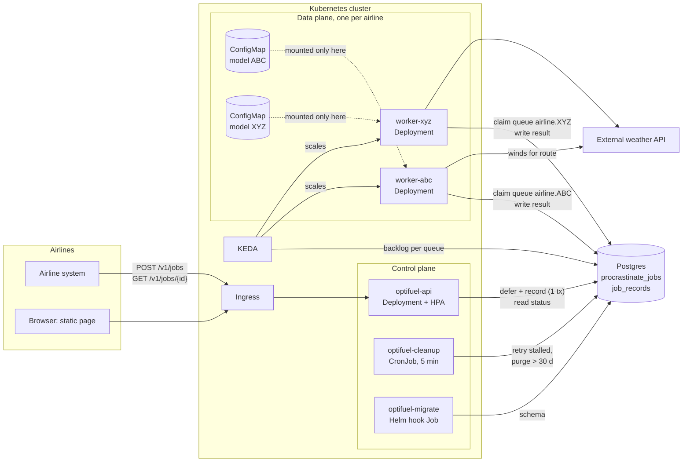
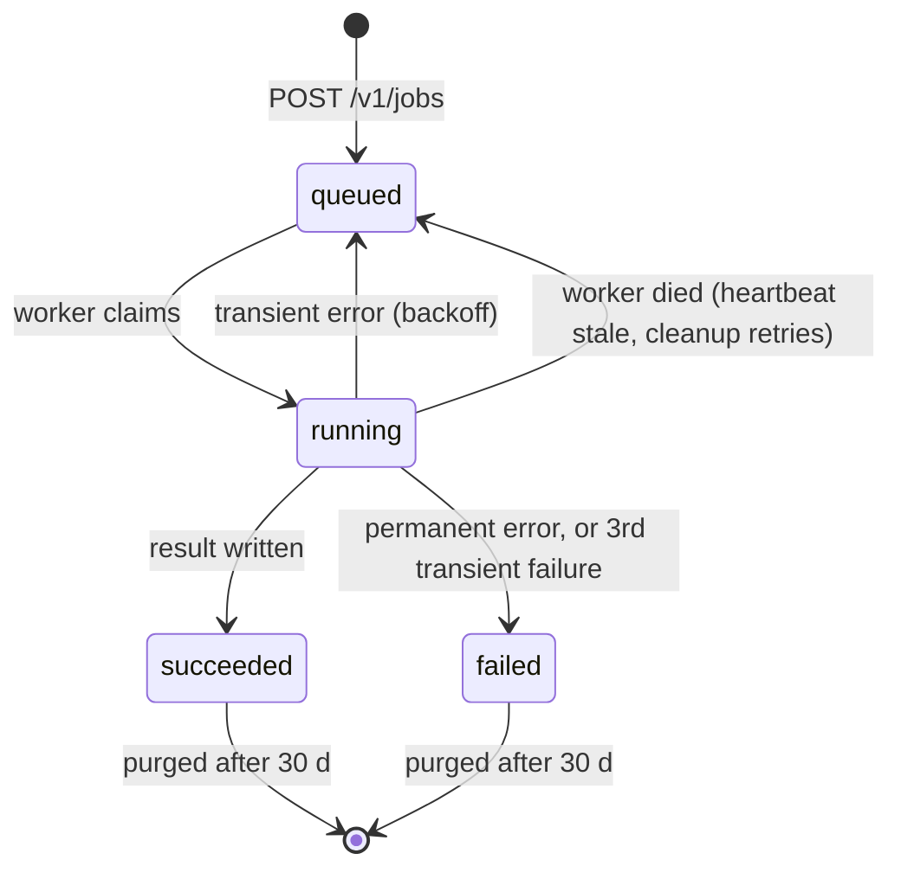
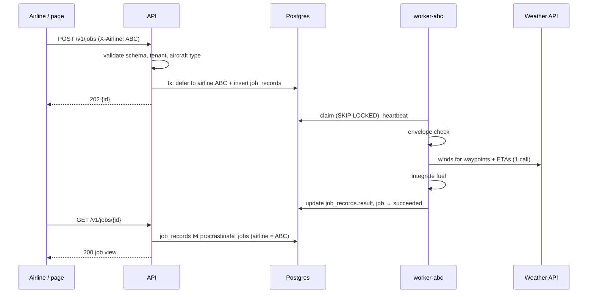

# OptiFuel architecture

How OptiFuel is built and why. Setup, API and commands: [`README.md`](README.md).

## 1. Overview

- **Control plane**, shared: API, Postgres, cleanup.
- **Data plane**, per airline: one worker Deployment and that airline's model.



**Event-driven.** A flight plan is an event. The API validates it and appends it to the airline's
queue; it never calls a worker. Workers consume at their own pace, so each side scales and fails
on its own. HTTP is only the entry point.

### At a glance

| Question | Answer |
|---|---|
| How do events enter? | `POST /v1/jobs`. The API validates the plan, queues it on `airline.<CODE>` and records the job in one transaction, then answers `202 {id}`. The client polls. |
| Where are models stored? | JSON files `<CODE>/<version>.json`: coefficients and validity envelope, no code. On Kubernetes, one ConfigMap per airline, mounted only into that airline's worker. |
| How is the model picked? | By routing. Only the airline's worker reads the airline's queue, and it loaded the version set in config at startup. It checks the file's own `airline` and `version`. |
| How are tenants isolated? | Own queue, worker and model per airline. Shared API and Postgres, every query filtered by airline. |
| How do workers scale? | KEDA scales each airline's workers on that airline's backlog. The API scales on CPU. |
| What survives a failure? | Queued jobs, in Postgres. Transient errors retry; a dead worker's jobs are requeued. |
| How does it extend? | A new step is one function call; a new job type or model family is one more union member (§7). |

## 2. Decisions

| # | Decision | Rejected | Why |
|---|---|---|---|
| D1 | One generic job contract (`id, type, airline, status, attempts, timestamps, result, error`). `fuel_estimate` is the only type. | Multi-team job platform; no contract. | New job types fit without API changes. A platform nobody asked for is YAGNI. |
| D2 | Long-running workers pulling from a queue. | Kubernetes `Job` per event; CRD operator; KEDA `ScaledJob`. | Inference takes milliseconds, pod start takes seconds. Workers keep the model in memory. |
| D3 | Postgres holds queue, records and results. | Kafka / Pub/Sub; Redis + Postgres. | ~10⁵ flights/day is tens of events/s at peak (estimate), well within Postgres. Queue and record share one transaction. One stateful dependency. |
| D4 | Procrastinate as the queue library. | Hand-rolled `SKIP LOCKED`; PgQueuer; DBOS; oban-py. | Mature. Per-queue workers, selective retries, heartbeat stall detection, retention, in-memory connector for tests. |
| D5 | HTTP in, polling out. | Broker ingress; webhooks; SSE. | Simplest for an airline; no extra infrastructure. |
| D6 | Per-airline queue, worker and model mount. | Shared worker pool; namespace or database per airline. | A worker can't read another airline's model; a busy airline can't starve the others. Namespace per airline is the premium tier, same chart. |
| D7 | Models as JSON parameters plus envelope, version pinned in config. | pickle / joblib; ONNX. | Loading runs no code. The model is 3 numbers. |
| D8 | Fuel = Σ fuel flow × segment time, with wind-corrected ground speed. Outside the envelope, the job fails. | Ignore wind; extrapolate; clamp. | Wind doesn't change fuel flow but does change time over ground. Underestimating fuel is a safety risk. |
| D9 | Mocked auth: trusted `X-Airline` header. | OIDC or API keys now. | PoC scope. Isolation rules are still enforced and tested; one dependency to swap. |
| D10 | Static page, no build step. | SPA. | One form and one table. |
| D11 | Helm for Kubernetes, compose for local, kind smoke in CI. | Kustomize. | Helm loops over `tenants` to render per-airline resources. |
| D12 | Logs with `job_id` and `airline`; `/health`, `/ready`. | Metrics and tracing now. | Enough for a PoC. Metrics come first (§9). |
| D13 | Duplicate = same plan while still queued, via the queue's lock. Once claimed, a new job. | App-level dedupe; reusing finished results. | One mechanism. A reused result has stale winds. |

**Kafka** earns its place when several consumers need the events, replay or audit is required,
or there is an event backbone to join. The ingress then reads a topic and queues jobs the same
way; workers don't change.

## 3. Job lifecycle



- **Transient**, retried (3 attempts, waits 5 s then 25 s): weather timeout, connection error or
  5xx; Postgres `OperationalError`.
- **Permanent**, fails at once: out of envelope, ground speed ≤ 0, weather 4xx or malformed reply.
- **Rejected before queueing**: see the README's API section (401, 403, 422).
- **Duplicates** (D13): `plan_key = sha256(payload)`, hashed before `departure_time` defaults.
  While a job with lock `{airline}:{plan_key}` is queued, the API returns that job's id.
- A failed job keeps its last error. Permanent errors spell the cause (`out_of_envelope: ...`);
  a transient one ends as `weather_unavailable`, anything unexpected as `internal_error`, since
  exception text quotes URLs and upstream bodies. The traceback is in the worker log.
  Resubmitting creates a new job.



## 4. Data

- `procrastinate_jobs` (owned by Procrastinate): queue, status, attempts. The only source of
  status.
- `job_records` (ours, [`src/sql/schema.sql`](src/sql/schema.sql)): airline, type, flight id, plan
  key, timestamps, result, error. Deleted with its job (`ON DELETE CASCADE`).
- The API writes both in one transaction: `configure_task(..., connection=conn).defer(...)`.
- The worker writes `error` on every failed attempt; success writes `result` and clears `error`.

## 5. Tenant isolation

| Asset | Isolation | How |
|---|---|---|
| Compute | Physical | Own worker Deployment and KEDA scaler |
| Model | Physical | Own ConfigMap, mounted only into its worker |
| Queue | Logical | `airline.<CODE>`; a worker listens to its own queue only |
| Job data | Logical | Every query filters by airline; another airline's job is 404 |
| Identity | Mocked | `X-Airline` header (D9) |

A worker without its airline's model refuses to start. No default model, no shared fallback.

**Limitation:** job data is isolated in application code only. Upgrade: Postgres row-level
security, then a database per airline.

## 6. Fuel estimation

Model from exercise 1 (Q4): linear regression on log scales. Validated by fitting 78 flights and
checking 19 hidden ones (about 1% error), then refit on all 97 flights. The 95% confidence
intervals of the exponents contain exactly 1 and −2.

$$ff = e^{12.75604}\, v^{1.00009}\, h^{-1.99912} \approx 346\,600 \cdot \frac{v}{h^{2}}$$

`ff` in lb/h, `v` true airspeed in km/h, `h` altitude in ft. Valid for 24–238 km/h and
1000–10 000 ft. The data is simulated (0.08–84 lb/h, where an airliner burns thousands), so
results compare routes correctly but are not real-world pounds.

```json
{
  "airline": "ABC", "version": "2026-09-30", "form": "power_law",
  "coefficients": {"ln_c": 12.75604, "speed": 1.00009, "altitude": -1.99912},
  "envelope": {"speed_kmh": [24, 238], "altitude_ft": [1000, 10000]}
}
```

Per segment *i* (waypoint *i* to *i+1*):

1. Any waypoint outside the envelope fails the job (`out_of_envelope`, with indices).
2. Distance `dᵢ` (haversine) and bearing `θᵢ`.
3. ETAs from still-air time, starting at `departure_time` (default: time received). One weather
   call returns wind speed `wᵢ` (kt) and direction `φᵢ` for all waypoints. Limitation: ETAs
   ignore wind; iterate once with ground-speed ETAs if forecast error matters.
4. Ground speed `gsᵢ = vᵢ − 1.852 · wᵢ · cos(φᵢ − θᵢ)`. `gsᵢ ≤ 0` fails the job.
5. `fuelᵢ = ff(vᵢ, hᵢ) · dᵢ / gsᵢ`. Result: total fuel, distance, duration, model version.

## 7. Code structure

Calls flow one way: controllers (HTTP) → services (rules) → repositories (storage) and clients
(external I/O). Dependencies are passed in, typed by a `Protocol`, so tests hand in fakes.

| Seam | Real | In tests |
|---|---|---|
| `JobStore` | SQL on `job_records ⋈ procrastinate_jobs` | Dict over Procrastinate's `InMemoryConnector` |
| `WeatherClient` | HTTP, bearer token, 5 s timeout, `POST /winds` | Fake returning set winds or errors |
| `Clock` | `datetime.now(UTC)` | Fixed time |
| `FileModelRepository` | JSON under `OPTIFUEL_MODEL_DIR` | Temp directory |

- `services/jobs.py` owns the queue: Procrastinate app, the `fuel_estimate` task and its retries,
  queue names, status mapping, duplicate detection.
- `services/tenants.py` owns tenant rules: known airline (401), enabled aircraft (422), model
  version. Nothing else reads the tenant config.
- `worker.py` `build()` checks tenant, weather config and model before opening any connection,
  so fail-fast startup is tested offline.

**Extending:**

- New pipeline step (e.g. a route check): one more function call in `FuelService`, raising
  `FuelEstimateError` to fail the job.
- New job type: `JobSubmission.type` becomes a discriminated union, plus one `register_<type>`
  task.
- New model family: `FuelModel.form` becomes a discriminated union, plus its fuel-flow function.
- New model source (object storage): `FileModelRepository` gains a `ModelRepository` Protocol.

## 8. Scaling and failures

Each airline gets a KEDA `ScaledObject` (rendered from `tenants`) that counts its `todo` and
`doing` jobs, with a target of 10 per replica. With `keda.enabled=false`, workers run at
`minReplicas`. The stateless API scales on CPU.

| Failure | Behaviour |
|---|---|
| Worker crashes mid-job | Heartbeat stale after 30 s; cleanup requeues it. Limitation: a job that kills its worker every time is requeued every run; cap it if that shows up |
| Weather API down or slow | 5 s timeout, retried, `failed` after 3 attempts with the error kept |
| Postgres down | `/ready` fails, API leaves the Service; workers reconnect; queued jobs survive |
| Bad or missing model | Worker fails at startup (CrashLoopBackOff); jobs wait queued |
| Traffic burst | Jobs queue; KEDA adds workers for that airline only |
| Duplicate submission | Queued job's id returned (D13) |

Production Postgres is managed (RDS / Cloud SQL) with backups and a standby; add PgBouncer when
worker count pushes connection limits.

## 9. Not now

| Item | Trigger |
|---|---|
| Real auth (OIDC at the gateway) | Any exposure beyond the demo |
| Row-level security, database per airline | Contract or audit requirement |
| Object storage for models | Models over 1 MiB (ConfigMap limit) or produced by a training pipeline |
| Webhooks / SSE | Airlines asking for push; Postgres `LISTEN/NOTIFY` feeds it |
| Kafka | See §2 |
| Prometheus metrics, OpenTelemetry traces | First production environment |
| Weather cache | Weather API rate limits or cost |
| Job cancel endpoint | Long-running job types |
| Migration tool | First Procrastinate schema upgrade |
