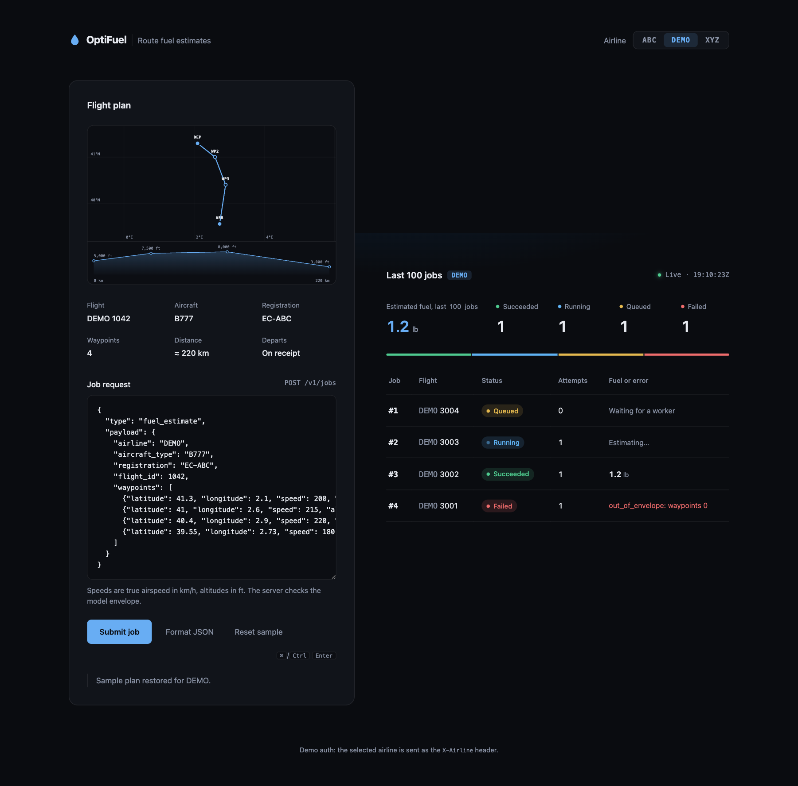
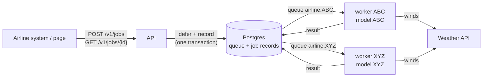

# OptiFuel

OptiFuel is a multi-tenant job processor that turns airline flight plans into route fuel estimates.
An airline submits a plan over HTTP, a worker dedicated to that airline runs the airline's own fuel
model against the route and the forecast winds, and the airline polls the job until it holds a
result or an error. The control plane (API, Postgres) is shared; compute, models and job data are
isolated per airline.



This repository also holds the fuel flow analysis that produced the model (`exercise_1/`, see
[Exercise 1](#exercise-1-fuel-flow-analysis)).

## Features

- **One job contract.** `POST /v1/jobs` returns `202 {id}`; `GET /v1/jobs/{id}` tracks it through
  `queued → running → succeeded | failed` with attempts, timestamps, result and last error.
- **Tenant isolation.** Each airline has its own queue, worker deployment and model mount. An
  airline sees only its own jobs; an unknown airline or a disabled aircraft type is rejected before
  anything is queued.
- **Physics-based estimate.** Fuel = Σ fuel flow × segment time over great-circle segments, with
  ground speed corrected by the wind at each waypoint's ETA. A waypoint outside the model's
  validity envelope fails the job explicitly rather than extrapolating.
- **Resilient by construction.** Postgres is the only stateful dependency: queueing a job and
  recording it share one transaction. Transient errors (weather API down, database blip) retry
  with backoff; a worker that dies mid-job has its work requeued; duplicate submissions of a plan
  that is still queued return the existing job.
- **Elastic workers.** KEDA scales each airline's workers on that airline's backlog, so a busy
  airline never starves another. The API scales on CPU.
- **Operable.** `/health` and `/ready` probes, structured logs carrying `job_id` and `airline`, a
  cleanup job that retries stalled work and purges finished jobs after a retention period.
- **Built-in page.** A dependency-free static page to pick an airline, edit and submit a plan (with
  a live route chart and altitude profile), and watch jobs update every two seconds.

## How it works



- **API** (FastAPI): validates the plan, checks the tenant, queues the job. Stateless.
- **Workers** (one deployment per airline, [Procrastinate](https://procrastinate.readthedocs.io/)
  on Postgres): claim their airline's jobs, fetch winds, integrate fuel, write the result.
- **Postgres**: queue and job records in one database; no broker.
- **Cleanup** (cron): requeues jobs from dead workers, purges old ones.

Design, decisions and rejected alternatives: [`ARCHITECTURE.md`](ARCHITECTURE.md). Domain
vocabulary: [`GLOSSARY.md`](GLOSSARY.md).

### API

Every `/v1` request carries the caller's airline in the `X-Airline` header (demo authentication;
production swaps this one dependency for OIDC at the gateway).

| Method | Path | Result |
|---|---|---|
| `POST` | `/v1/jobs` | `202 {"id": ...}`; a plan still queued returns the existing job's id |
| `GET` | `/v1/jobs/{id}` | Job view; `404` if missing or owned by another airline |
| `GET` | `/v1/jobs?limit=50` | Caller's jobs, newest first (`limit` 1..100) |
| `GET` | `/v1/tenants` | Configured airline codes (feeds the page's selector) |
| `GET` | `/health`, `/ready` | Liveness; readiness (`SELECT 1` against Postgres) |
| `GET` | `/` | The page |

Request body: `{"type": "fuel_estimate", "payload": <flight plan>}`. A flight plan is `airline`,
`aircraft_type`, `registration`, `flight_id`, an optional timezone-aware `departure_time`, and at
least two `waypoints`, each `{latitude, longitude, speed, altitude}` with speed as true airspeed
in km/h and altitude in ft.

```json
{
  "id": 42, "type": "fuel_estimate", "airline": "ABC", "flight_id": 1042,
  "status": "succeeded", "attempts": 1,
  "submitted_at": "2026-09-30T10:00:00Z", "finished_at": "2026-09-30T10:00:01Z",
  "result": {"total_fuel_lb": 1.656, "distance_km": 220.498, "duration_h": 1.012,
             "model_version": "2026-09-30"},
  "error": null
}
```

Rejections never reach the queue: `422` for a malformed plan, unknown job type or aircraft type
not enabled for the airline; `401` for a missing or unknown `X-Airline`; `403` when
`payload.airline` differs from the header.

## Quick start

Requires Docker with Compose v2.

```sh
docker compose up --build
```

This brings up Postgres, applies the schema, starts the API on <http://localhost:8000>, one worker
each for airlines `ABC` and `XYZ`, the cleanup loop, a WireMock stand-in for the weather API, and
seeds a fake airline `DEMO` with one job in every status so the page shows them all.

Submit a plan from the shell:

```sh
curl -H 'X-Airline: ABC' -H 'Content-Type: application/json' localhost:8000/v1/jobs -d '{
  "type": "fuel_estimate",
  "payload": {
    "airline": "ABC", "aircraft_type": "B777", "registration": "EC-ABC", "flight_id": 1,
    "waypoints": [
      {"latitude": 41.3, "longitude": 2.1, "speed": 200, "altitude": 5000},
      {"latitude": 41.8, "longitude": 3.0, "speed": 180, "altitude": 4000}
    ]
  }
}'
curl -H 'X-Airline: ABC' localhost:8000/v1/jobs/<id>
```

Secrets default to development values; override them in a gitignored `.env` next to
`docker-compose.yaml` (`POSTGRES_PASSWORD`, `OPTIFUEL_WEATHER_TOKEN`).

## Running the services

One image, four entry points:

| Process | Command | Role |
|---|---|---|
| API | `uvicorn --factory src.api:from_env` (image default) | HTTP, page, probes |
| Worker | `python -m src.worker` | One per airline; refuses to start without that airline's model |
| Migrate | `python -m src.migrate` | One-shot: Procrastinate schema + `job_records` |
| Cleanup | `python -m src.cleanup` | One-shot: requeue stalled jobs, purge finished ones |

Configuration is environment variables, prefixed `OPTIFUEL_`:

| Variable | Used by | Meaning |
|---|---|---|
| `OPTIFUEL_DATABASE_URL` | all | Postgres URL (secret) |
| `OPTIFUEL_ENVIRONMENT` | all | `dev` (default) or `prod` |
| `OPTIFUEL_TENANTS` | API, worker | JSON: `{"ABC": {"aircraft_types": ["B777"], "model_version": "2026-09-30"}}` |
| `OPTIFUEL_WORKER_AIRLINE` | worker | Airline code this worker serves |
| `OPTIFUEL_MODEL_DIR` | worker | Directory holding `<airline>/<version>.json`, default `/models` |
| `OPTIFUEL_WEATHER_URL` | worker | Weather API base URL |
| `OPTIFUEL_WEATHER_TOKEN` | worker | Weather API bearer token (secret) |
| `OPTIFUEL_RETENTION_DAYS` | cleanup | Purge finished jobs after this many days, default 30 |

Models are JSON files (`models/<AIRLINE>/<version>.json`) holding the fitted coefficients and
the validity envelope; loading runs no code.

## Deployment

### Kubernetes (Helm)

The chart at `deploy/helm/optifuel` renders the API (Deployment, Service, HPA), one worker
Deployment plus model ConfigMap plus KEDA `ScaledObject` per airline listed under `tenants`, a
migrate hook Job and the cleanup CronJob. Postgres is expected to be managed; KEDA is expected to
be installed.

```sh
kubectl create secret generic optifuel \
  --from-literal=database-url='postgresql://...' \
  --from-literal=weather-token='...'

helm install optifuel deploy/helm/optifuel -f <values> \
  --set weather.url=https://weather.example \
  --set image.tag=<tag> --set image.digest=sha256:<digest> \
  --set-file tenants.ABC.model=models/ABC/2026-09-30.json
```

Values reference: [`deploy/helm/optifuel/values.yaml`](deploy/helm/optifuel/values.yaml). Set
`keda.enabled=false` to pin each worker at its minimum replicas. There is no Ingress template:
front the `optifuel-api` Service with the cluster's ingress.

### Kind smoke

`deploy/kind-smoke.sh` creates a kind cluster, installs KEDA, builds and loads the image, installs
the chart with in-cluster Postgres and weather stub (`values-kind.yaml`), then checks that a plan
succeeds, that a backlog scales `worker-abc` past one replica, that a job whose worker pod is
killed mid-run still succeeds, and that `keda.enabled=false` holds the minimum replica count.
Needs docker, kind, helm, kubectl, curl, jq, openssl. The cluster is deleted on exit;
`KEEP_CLUSTER=1` keeps it and prints its kubeconfig.

### Kind dev environment

`deploy/kind-dev.sh` does the same install on cluster `optifuel-dev` (no checks), then
port-forwards the API to `localhost:18000`, the weather stub to `localhost:18080` and Postgres
to `localhost:15432`, prints the `OPTIFUEL_DATABASE_URL` for `scripts/seed.py` and `src.cleanup`,
and blocks until Ctrl-C. The cluster stays; a rerun rebuilds the image and rolls the pods;
`deploy/kind-dev.sh down` deletes it. `API_PORT`, `STUB_PORT`, `PG_PORT` override the ports.

### Docker image

```sh
docker build -t optifuel .
docker run --rm -p 8000:8000 -e OPTIFUEL_DATABASE_URL=postgresql://unused optifuel
```

Runs the API alone: `/health` and `/` answer, `/ready` needs Postgres. The image installs runtime
dependencies only and runs as a non-root user.

## Development

Requires [uv](https://docs.astral.sh/uv/); it installs the pinned Python (`.python-version`).

```sh
uv sync                        # venv + all groups (dev, analysis)
uv run pre-commit install      # git hooks
```

| Task | Command |
| --- | --- |
| Tests + coverage | `uv run pytest` |
| Lint + format + type check (all hooks) | `uv run pre-commit run --all-files` |
| Lint / fix | `uv run ruff check --fix` |
| Format | `uv run ruff format` |
| Type check | `uv run ty check` |
| Local stack | `docker compose up --build`; page and API on `localhost:8000` |
| Re-seed demo data (airline `DEMO`, one job per status) | `docker compose run --rm seed`. Outside compose: `uv run python scripts/seed.py` with `OPTIFUEL_DATABASE_URL`; refuses when `OPTIFUEL_ENVIRONMENT=prod` |
| Run cleanup once | `docker compose run --rm cleanup python -m src.cleanup` |
| API (dev, reload) | `OPTIFUEL_DATABASE_URL=postgresql://... uv run uvicorn --factory src.api:from_env --reload` |
| Worker (one per airline) | `uv run python -m src.worker` with the worker variables above |
| Migrate | `uv run python -m src.migrate` with `OPTIFUEL_DATABASE_URL` |
| Cleanup | `uv run python -m src.cleanup` with `OPTIFUEL_DATABASE_URL` |
| Kind smoke | `deploy/kind-smoke.sh` |
| Kind dev environment | `deploy/kind-dev.sh` (`down` deletes the cluster) |
| Exercise 1 notebook | `uv run jupyter lab exercise_1/analysis.ipynb` |

### Layout

```
src/
  api.py             composition root: Settings → clients → repositories → services → FastAPI app
  config.py          Settings, the one environment-variable reader
  schemas.py         pydantic models: FlightPlan, JobView, model file
  controllers/       FastAPI routers: parse request, call one service, map result or error to HTTP
  services/          business rules: tenants.py (registry), jobs.py (queue), fuel.py (pipeline)
  repositories/      persistence: protocols.py (JobStore), postgres.py, files.py (models)
  clients/           external I/O: weather.py, clock.py
  worker.py          worker process
  migrate.py         one-shot: apply schema
  cleanup.py         one-shot: retry stalled jobs, purge old ones
  sql/schema.sql
  static/            index.html, style.css, app.js
tests/               end-to-end over TestClient with fakes at the outer edge; one file per feature
deploy/              helm/optifuel, kind-smoke.sh, kind-dev.sh, weather-stub/
scripts/             seed.py (dev tooling, not shipped in the image)
models/              per-airline model files
exercise_1/          fuel flow analysis
```

Calls flow controller → service → repository or client, one direction. Every repository and
client is a `Protocol` injected at construction; `api.py` builds the real ones at startup and tests
hand in fakes through `app.dependency_overrides`. Tests run offline: the real Procrastinate task
runs on its `InMemoryConnector`.

### Tooling

- **uv**: environment, Python version, lockfile. Dependency groups: `dev` (tests, lint, types),
  `analysis` (JupyterLab, plotting).
- **ruff** (lint + format), **ty** (type checker; any diagnostic fails), **pytest** + **pytest-cov**.
  Configuration lives in `pyproject.toml`; warnings are errors.
- **pre-commit**: ruff, ty, zizmor (GitHub Actions audit; actions must be SHA-pinned), `uv.lock`
  sync check, file hygiene, private-key detection.
- **GitHub Actions** (`.github/workflows/ci.yml`): three jobs, Lint, Test and Docker (image
  build). **Dependabot** bumps uv dependencies, actions, and Docker images (Dockerfile, Compose,
  Helm) weekly. `kindest/node` in `deploy/kind-smoke.sh` and `deploy/kind-dev.sh` is updated by
  hand.

## Exercise 1: fuel flow analysis

`exercise_1/analysis.ipynb` (outputs committed) explores the provided `signals_*.pkl` datasets and
fits the fuel flow model that OptiFuel ships (`ff ≈ 346 600 · v / h²`, `v` in km/h, `h` in ft,
valid for 24–238 km/h and 1 000–10 000 ft). The notebook holds the narrative; `cleanup.py`,
`compute.py` and `plot.py` hold the logic.
