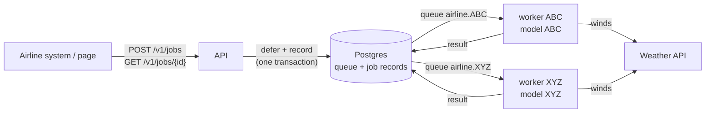

# OptiFuel

Multi-tenant service that turns airline flight plans into fuel estimates. An airline submits a
plan; a worker dedicated to that airline runs the airline's own model against the route and the
forecast winds; the airline polls for the result.


Design and decisions: [`ARCHITECTURE.md`](ARCHITECTURE.md). Vocabulary:
[`GLOSSARY.md`](GLOSSARY.md). Model analysis: [Exercise 1](#exercise-1-fuel-flow-analysis).

## How it works



- **API** (FastAPI): validates the plan and the airline, queues the job. Stateless.
- **Workers** ([Procrastinate](https://procrastinate.readthedocs.io/)): one deployment per
  airline. Claim that airline's jobs, fetch winds, compute fuel, write the result.
- **Postgres**: queue and results. No broker.
- **Cleanup** (cron): requeues jobs from dead workers, purges old ones.

Each airline has its own queue, worker and model, and sees only its own jobs. Transient errors
retry; a plan outside the model's valid range fails instead of extrapolating. KEDA scales each
airline's workers on its own backlog.

## Quick start

Requires Docker with Compose v2.

```sh
docker compose up --build
```

Starts Postgres, the API and page on <http://localhost:8000>, workers for airlines `ABC` and
`XYZ`, cleanup, and a weather API stub. A demo airline `DEMO` is seeded with one job per status.

```sh
curl -H 'X-Airline: ABC' -H 'Content-Type: application/json' localhost:8000/v1/jobs -d '{
  "type": "fuel_estimate",
  "payload": {
    "airline": "ABC", "aircraft_type": "B777", "registration": "EC-ABC", "flight_id": 1,
    "route": [
      {"latitude": 41.3, "longitude": 2.1, "speed": 200, "altitude": 5000},
      {"latitude": 41.8, "longitude": 3.0, "speed": 180, "altitude": 4000}
    ]
  }
}'
curl -H 'X-Airline: ABC' localhost:8000/v1/jobs/<id>
```

Secrets default to dev values; override `POSTGRES_PASSWORD` and `OPTIFUEL_WEATHER_TOKEN` in a
gitignored `.env`.

## API

Every `/v1` call sends the caller's airline in `X-Airline` (mocked auth; production swaps it for
OIDC).

| Method | Path | Result |
|---|---|---|
| `POST` | `/v1/jobs` | `202 {"id": ...}`; a plan still queued returns the existing id |
| `GET` | `/v1/jobs/{id}` | Job view; `404` if missing or another airline's |
| `GET` | `/v1/jobs?limit=50` | Own jobs, newest first (`limit` 1–100) |
| `GET` | `/v1/tenants` | Configured airlines (for the page) |
| `GET` | `/health`, `/ready` | Liveness; readiness (Postgres reachable) |
| `GET` | `/` | The page |

Body: `{"type": "fuel_estimate", "payload": <flight plan>}`. A flight plan has `airline`,
`aircraft_type`, `registration`, `flight_id`, optional `departure_time` (with timezone), and a
`route` of 2–500 waypoints `{latitude, longitude, speed, altitude}`: speed is true airspeed in
km/h, altitude in ft.

```json
{
  "id": 42, "type": "fuel_estimate", "airline": "ABC", "flight_id": 1042,
  "status": "succeeded", "attempts": 1,
  "submitted_at": "2026-09-30T10:00:00Z", "finished_at": "2026-09-30T10:00:01Z",
  "result": {"total_fuel_lb": 1.657, "distance_km": 220.498, "duration_h": 1.012,
             "model_version": "2026-09-30"},
  "error": null
}
```

`status`: `queued → running → succeeded | failed`. Rejected before queueing: `401` unknown or
missing airline, `403` plan airline differs from the header, `422` invalid plan, unknown job type
or aircraft type not enabled.

## Configuration

One image, four processes:

| Process | Command | Role |
|---|---|---|
| API | `uvicorn --factory src.api:from_env` (default) | HTTP, page, probes |
| Worker | `python -m src.worker` | One per airline; won't start without its model |
| Migrate | `python -m src.migrate` | One-shot: apply schema |
| Cleanup | `python -m src.cleanup` | One-shot: requeue stalled jobs, purge old ones |

| Variable | Used by | Meaning |
|---|---|---|
| `OPTIFUEL_DATABASE_URL` | all | Postgres URL (secret) |
| `OPTIFUEL_ENVIRONMENT` | all | `dev` (default) or `prod` |
| `OPTIFUEL_TENANTS` | API, worker | JSON: `{"ABC": {"aircraft_types": ["B777"], "model_version": "2026-09-30"}}` |
| `OPTIFUEL_WORKER_AIRLINE` | worker | Airline this worker serves |
| `OPTIFUEL_MODEL_DIR` | worker | Holds `<airline>/<version>.json`; default `/models` |
| `OPTIFUEL_WEATHER_URL` | worker | Weather API base URL |
| `OPTIFUEL_WEATHER_TOKEN` | worker | Weather API bearer token (secret) |
| `OPTIFUEL_RETENTION_DAYS` | cleanup | Days to keep finished jobs; default 30 |

Models are JSON files (`models/<AIRLINE>/<version>.json`): coefficients plus the valid range.
Loading runs no code.

## Deployment

### Kubernetes (Helm)

`deploy/helm/optifuel` renders the API (Deployment, Service, HPA), per airline a worker, model
ConfigMap and KEDA `ScaledObject`, the migrate hook and the cleanup CronJob. Expects managed
Postgres and KEDA installed. No Ingress template: front `optifuel-api` with the cluster's ingress.

```sh
kubectl create secret generic optifuel \
  --from-literal=database-url='postgresql://...' \
  --from-literal=keda-database-url='postgresql://...' \
  --from-literal=weather-token='...'

helm install optifuel deploy/helm/optifuel -f <values> \
  --set weather.url=https://weather.example \
  --set image.tag=<tag> --set image.digest=sha256:<digest> \
  --set-file tenants.ABC.model=models/ABC/2026-09-30.json
```

Values: [`values.yaml`](deploy/helm/optifuel/values.yaml). `keda-database-url` is a role with
`SELECT` on `procrastinate_jobs` only: the KEDA operator holds it in its own namespace, so it
never gets the app's write access. `keda.enabled=false` pins workers at their minimum replicas.

### Kind

- `scripts/kind-smoke.sh`: creates a kind cluster with KEDA, in-cluster Postgres and weather stub,
  then checks that a plan succeeds, a backlog scales workers, a job survives its worker being
  killed, and KEDA off holds the minimum. Deletes the cluster on exit (`KEEP_CLUSTER=1` keeps
  it). CI runs it. Needs docker, kind, helm, kubectl, curl, jq, openssl.
- `scripts/kind-dev.sh`: same install, no checks, on cluster `optifuel-dev`. Forwards API
  `:18000`, weather stub `:18080`, Postgres `:15432` (override with `API_PORT`, `STUB_PORT`,
  `PG_PORT`). A rerun rebuilds and rolls the pods; `down` deletes the cluster.

### Docker image

```sh
docker build -t optifuel .
docker run --rm -p 8000:8000 -e OPTIFUEL_DATABASE_URL=postgresql://unused optifuel
```

Runs the API alone; `/ready` needs Postgres. Runtime dependencies only, non-root user.

## Development

Requires [uv](https://docs.astral.sh/uv/), which installs the pinned Python.

```sh
uv sync                        # venv + all groups (dev, analysis)
uv run pre-commit install      # git hooks
```

| Task | Command |
| --- | --- |
| Tests + coverage | `uv run pytest` |
| All checks (ruff, ty, zizmor, lockfile, hygiene) | `uv run pre-commit run --all-files` |
| Lint / format / types | `uv run ruff check --fix`, `uv run ruff format`, `uv run ty check` |
| Local stack | `docker compose up --build` |
| Re-seed demo data | `docker compose run --rm seed` (or `uv run python scripts/seed.py`; refuses in `prod`) |
| Run cleanup once | `docker compose run --rm cleanup python -m src.cleanup` |
| API with reload | `OPTIFUEL_DATABASE_URL=postgresql://... uv run uvicorn --factory src.api:from_env --reload` |
| Worker, migrate, cleanup | `uv run python -m src.<worker\|migrate\|cleanup>` with the variables above |
| Kind smoke / dev | `scripts/kind-smoke.sh`, `scripts/kind-dev.sh` |
| Exercise 1 notebook | `uv run jupyter lab exercise_1/analysis.ipynb` (needs the datasets, see below) |

CI (`.github/workflows/ci.yml`) runs four jobs: Lint, Test, Docker, Kind Smoke. Warnings are
errors; tool config lives in `pyproject.toml`. Dependabot bumps dependencies, actions and images
weekly; `kindest/node` in the kind scripts is bumped by hand.

### Layout

```
src/
  api.py          composition root: settings → clients → repositories → services → app
  config.py       Settings, the only environment reader
  schemas.py      pydantic models: FlightPlan, JobView, model file
  controllers/    HTTP routers
  services/       rules: tenants.py, jobs.py (queue), fuel.py (estimate)
  repositories/   storage: protocols.py, postgres.py, files.py (models)
  clients/        external I/O: weather.py, clock.py
  worker.py, migrate.py, cleanup.py
  sql/, static/
tests/            end-to-end over HTTP, fakes at the edges, one file per feature
deploy/           Helm chart, weather stub
scripts/          dev tooling (not in the image)
models/           per-airline model files
exercise_1/       fuel flow analysis
```

## Exercise 1: fuel flow analysis

`exercise_1/analysis.ipynb` (outputs committed) finds the fuel flow rule OptiFuel ships. The
notebook tells the story and explains each statistics idea where it is used; `cleanup.py`,
`compute.py` and `plot.py` hold the logic. The datasets are not distributed: to rerun, place
`signals_{fuel_flow,altitude,speed,wind}.pkl` (one DataFrame each, a column per flight, a row
per time step) in `exercise_1/`; they are gitignored.

1. **Clean**: 4000 rows become 582 points. Drop padding, 7 spikes and 3 flights with broken
   sensors (7, 12, 44); keep one row per steady step, so copies don't count as new evidence.
2. **Look**: correlation with fuel on log scales: altitude −0.90, speed +0.42, wind −0.04.
3. **Fit**: linear regression on log scales gives `ff ≈ 346 600 · v / h²` (`v` km/h, `h` ft).
   Twice as fast, twice the fuel; twice as high, a quarter.
4. **Check**: split by whole flight, 78 to fit and 19 hidden. On the hidden flights the error is
   about 1% (MAPE 0.97%, R² 0.99985).
5. **Wind**: adding it changes nothing. Speed is airspeed, so wind changes time over the
   ground, not fuel per hour.

Valid only for 24–238 km/h and 1000–10 000 ft, the range of the data.
